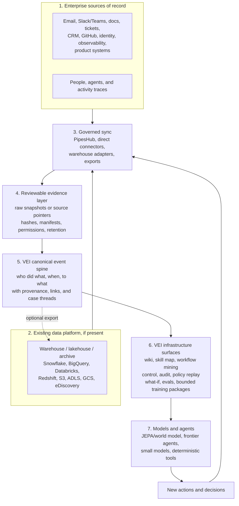

## VEI

[](https://deepwiki.com/Strange-Lab-AI/vei)

VEI turns a company's email, Slack, tickets, docs, CRM, identity, and agent traces into a replayable company environment: building a canonical event spine that can be branched, audited, mined for workflows, and packaged into process-training worlds for AI agents.

From [Strange Lab](https://strangelab.ai). The first public release of our enterprise-AI infrastructure stack.

## The bet

Every company will need a machine-readable model of how work actually happens. VEI's bet is that the right primitive is a canonical event spine: who did what, when, to what, with provenance.



## Try it now

Live demos (no install, no API key):

- [strangelab.ai/enron](https://strangelab.ai/enron) — Enron what-if archive
- [strangelab.ai/public-history](https://strangelab.ai/public-history) — public news timeline


## Quick Start

```bash
git clone https://github.com/Strange-Lab-AI/vei.git
cd vei
make setup-full       # creates .venv, installs all extras
vei doctor            # checks environment
vei quickstart run    # launches Studio + Twin Gateway
```

`vei quickstart run` gives you:

- Studio at `http://127.0.0.1:3011`
- Twin Gateway at `http://127.0.0.1:3012`
- a seeded workspace with visible activity already in motion
- connection details in `.vei/quickstart.json`

**Requirements:** Python 3.11, ports 3011 and 3012 free. Local interactive LLM generation defaults to the Codex CLI (`gpt-5.3-codex-spark`). `OPENAI_API_KEY` in `.env` is only needed for explicit direct-provider runs or CI-style `llm-live`.

For the optional JEPA backend by itself:

```bash
pip install -e ".[jepa]"
```

`make setup-full` already includes this extra for full local development.

## What VEI gives you

Five surfaces across one spine:

- **Knowledge / Wiki / Skill Map** — materialize a company wiki with citations; compile draft agent skills from evidence.
- **Workflow Intelligence / Train** — mine repeated work, promote reviewed task specs, and package scoped process-training data. See [docs/RL_GYM.md](docs/RL_GYM.md).
- **Sandbox / What-if** — fork a world, change a policy or action, compare alternate paths. See [docs/WHATIF.md](docs/WHATIF.md).
- **Governor / Control** — gate writes, record agent activity, export evidence packs. See [docs/ARCHITECTURE.md](docs/ARCHITECTURE.md).
- **Test / Eval** — run agents against fixed company worlds and score them against contracts. See [docs/EVALS.md](docs/EVALS.md).

<details>
<summary>Open a saved example</summary>

Open the flagship Enron what-if bundle from a fresh clone — no API key needed:

```bash
vei ui serve \
  --root docs/examples/enron-master-agreement-public-context/workspace \
  --host 127.0.0.1 --port 3055
```

Studio exposes the what-if surface as two modes: **Live archive** for full-history exploration and **Saved reference** for the committed branch replay.

See [docs/EXAMPLES.md](docs/EXAMPLES.md) for all saved bundles (Enron, public history, Clearwater).

</details>

<details>
<summary>Bring your own company history</summary>

```bash
# Normalize raw exports into a verified bundle
vei context normalize \
  --source-dir <raw_input_path> \
  --org "YourCo" --domain "yourco.example" \
  --output _vei_out/yourco/context_snapshot.json

vei context verify --snapshot _vei_out/yourco/context_snapshot.json

# Or: onboard from live sources (GitHub, ClickUp, Gmail, Notion, Teams, etc.)
vei workspace twin onboard \
  --root _vei_out/yourco/twin \
  --org "YourCo" --domain "yourco.example" \
  --provider gmail --provider notion \
  --base-url gmail=/path/to/gmail-takeout.zip \
  --base-url notion=/path/to/notion-export.zip
```

For managed connector pipelines and tenant-level backfills:

- **PipesHub** (Gmail, Drive, Jira, Confluence, Salesforce, OneDrive, Outlook) — `pip install -e ".[pipeshub]"` then `vei connectors pipeshub up`. See [docs/CONNECTORS.md](docs/CONNECTORS.md#pipeshub).
- **Microsoft Teams via Graph** — direct tenant capture using `vei context teams capture`. See [docs/CONNECTORS.md](docs/CONNECTORS.md#microsoft-teams).

</details>

<details>
<summary>Run an LLM agent against the twin</summary>

```bash
vei eval llm-test run \
  --provider openai --model gpt-5 \
  --task "Triage the open exception and reply to the customer." \
  --artifacts _vei_out/yourco/llm_run

# Or score a model against a named benchmark family and its workflow contract.
VEI_OPENAI_REASONING_EFFORT=low vei eval benchmark \
  --runner llm \
  --family security_containment \
  --provider openai --model gpt-5-mini \
  --max-steps 32 --tool-top-k 48 \
  --artifacts-root _vei_out/benchmark
```

Named-family benchmark runs derive the agent task from the workflow objective, constraints, relevant tools, and known argument anchors. The result includes both the enterprise score and workflow-contract validation.

</details>

<details>
<summary>CLI map</summary>

All commands live under `vei <group> <command>`:

| Surface | Key commands |
|---|---|
| **Quickstart** | **`vei quickstart run`**, **`vei doctor`**, `vei eval smoke run` |
| **Test / Eval** | **`vei eval benchmark`**, `vei eval demo`, `vei eval showcase`, **`vei eval llm-test run`**, `vei eval agent-demo run`, `vei run start`, `vei admin report` |
| **Governor / Control** | `vei workspace twin serve`, `vei workspace twin onboard`, `vei workspace ingest agent-activity`, `vei provenance access-review`, `vei provenance verify`, `vei provenance export` |
| **Sandbox / What-if** | `vei whatif candidates`, `vei whatif events`, `vei whatif open`, `vei whatif experiment` (`--mode e_jepa` for the trained backend), `vei whatif rank`, `vei whatif pack run` |
| **Train / Data** | `vei rollout procurement`, `vei train bc`, `vei workflow package-env` |
| **Knowledge / Skills / Wiki** | `vei knowledge compose`, `vei knowledge ingest`, `vei knowledge skillmap build`, `vei knowledge skillmap refresh`, `vei wiki build`, `vei wiki refresh`, `vei wiki query` |
| **Workflow intelligence** | `vei workflow mine`, `vei workflow label`, `vei workflow promote`, `vei workflow refresh` |
| **Inspect / Debug** | `vei admin world list`, `vei inspect fidelity`, `vei workspace context timeline`, `vei workspace context readiness`, `vei admin visualize`, **`vei ui serve`** |
| **Project / Workspace** | `vei workspace project init`, `vei workspace project show`, `vei admin blueprint`, `vei admin contract`, `vei admin release` |

</details>

<details>
<summary>Repo checks</summary>

```bash
make check          # format, lint, types, import boundaries, security
make test           # fast tests (skips slow)
make check-full     # + bandit, semgrep, detect-secrets
make test-full      # full suite with coverage
make llm-live       # needs live API keys
make clean-workspace  # clears caches; leaves _vei_out/ runs alone
```

Exit codes: `0` pass · `1` test/gate failure · `2` cost ceiling exceeded · `3` infrastructure failure · `4` threshold/config missing.

</details>

## Where to Go Next

- [docs/AGENT_ONBOARDING.md](docs/AGENT_ONBOARDING.md) — fast repo briefing and 10-minute checklist for humans and agents
- [docs/ARCHITECTURE.md](docs/ARCHITECTURE.md) — module map, five infrastructure surfaces, runtime shape, what is and isn't learned
- [docs/WHATIF.md](docs/WHATIF.md) — world-model and what-if command reference
- [docs/EXAMPLES.md](docs/EXAMPLES.md) — Enron, public history, and Clearwater worked examples
- [docs/CONNECTORS.md](docs/CONNECTORS.md) — PipesHub pilot and Microsoft Teams Graph capture runbooks
- [CONTRIBUTING.md](CONTRIBUTING.md) — setup, daily loop, module boundaries, PR workflow

## About Strange Lab

Strange Lab builds world models for work — testing, governance, replay, and training over real organisational history. VEI is the first piece of that stack.

- GitHub: [github.com/Strange-Lab-AI](https://github.com/Strange-Lab-AI)
- Web: [strangelab.ai](https://strangelab.ai)
- Questions or bugs: open an issue on this repo.
