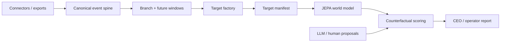

# VEI Architecture

Use `README.md` for install, product framing, and operator flows. Use this
document for module boundaries, runtime shape, and subsystem relationships. See
[GLOSSARY.md](GLOSSARY.md) for every term of art defined in one place.

VEI is a deterministic, MCP-native enterprise simulator built around one stable boundary: `WorldSession`.

## Runtime Shape

```text
Workspace / CLI / UI / SDK / Agent
                │
                ▼
         Project + Run surfaces
                │
        ┌───────┴───────┐
        ▼               ▼
  Router (MCP)    Twin Gateway (HTTP)
                  ├─ provider-shaped compat routes
                  ├─ governor agent registry
                  ├─ policy profiles + approval queue
                  └─ surface / connector enforcement
        │               │
        └───────┬───────┘
                ▼
          WorldSession kernel
          ├─ world state
          ├─ event queue
          ├─ actor state + receipts
          ├─ snapshots / branch / restore
          ├─ replay / injection
          └─ governor runtime (agent fleet, approvals, throttles, event feed)
```

The router is a transport and tool-dispatch adapter. The twin gateway is an HTTP adapter that exposes provider-shaped compatibility routes and manages governed agents. Mutable enterprise state belongs to the kernel, not to transport wrappers.

## One Kernel, Five Infrastructure Surfaces

VEI is one kernel with five infrastructure surfaces sharing the same world session, connector layer, event spine, replay model, and contract scoring:

- **Test / Eval** — run a fixed company world, score an agent, compare scripted vs LLM vs workflow runners
- **Governor / Control** — place VEI between agents and enterprise systems; govern, record, and replay what happened
- **Sandbox / What-if** — fork the same world, change policy or actions, compare alternate futures with snapshot comparisons
- **Train / Data** — turn traces and trajectories into rollouts, demonstrations, and bounded process-training packages
- **Knowledge / Wiki / Skill Map** — hydrate company records into a knowledge graph; materialize cited wiki pages over canonical evidence; compile company-specific agent skills from the normalized bundle with replay checks and evidence backing

## Product Glossary

Use these terms consistently in user-facing surfaces:

- **Workspace** — the on-disk VEI folder rooted by `vei_project.json`
- **Company** — the real-world organization represented by that workspace
- **Scenario** — a selectable situation configuration authored for a workspace
- **Run** — one execution of a scenario (workflow/scripted/bc/llm)
- **Provenance** — the governance and evidence surface (with Control and Audit sections)
- **Wiki** — the materialized company read model derived from canonical evidence

Copy-safe product language:

- The world kernel is the deterministic `WorldSession`: one mutable company state,
  one canonical event spine, typed enterprise facades, snapshots, branching, and
  replay.
- A workflow twin is a typed baseline run over that same kernel, not a separate
  script viewer. Workflow steps can resolve to graph-native actions or concrete
  tools at execution time, then write normal run events, snapshots, and contract
  results.
- Replay and shadow use the same boundary. Offline replay schedules recorded
  events or candidate futures into the kernel; governed twin mode can sit
  between outside agents and enterprise-shaped routes, recording, denying,
  allowing, or holding writes for approval. Live connectors are explicit and
  policy-gated rather than the default path.
- The agent-training surface is the event spine and derived run data: canonical
  events, recent state, doctrine or context, candidate actions, observed future
  events, state deltas, business heads, and human or judge preferences where
  available. Counterfactual rankings remain decision support, not causal proof.
- The knowledge and skill-map surface uses the same event spine, structure view,
  and capability graph. Knowledge compositions run deterministically or with
  bounded LLM authoring. Skill-map candidates carry evidence IDs, replay checks,
  and approval boundaries.

## Core Primitives

> If you're skimming, skip ahead to the subsystem sections below — these are the typed values used across modules.

- `CanonicalEvent`
  - frozen v1 envelope (`vei.events`) that is the single source of truth on the event spine; `StateStore`, run timelines, and connector receipts are derived views
- `DynamicsBackend`
  - protocol for forecast / learned-dynamics calls (`vei.dynamics`); backends (`null`, `heuristic_baseline`, `reference`, `external_subprocess`) register through one registry
- `SessionSlice`
  - lazy-hydration boundary produced by a `SessionMaterializer` from the ingest stores; what `WorldSession.from_session_materializer` consumes
- `Blueprint`
  - authored asset compiled into scenario, facades, workflow, contract, and run defaults
- `BlueprintAsset`
  - authoring root for scenario templates, capability-graph or environment seed data, facade requirements, and workflow defaults
- `CompiledBlueprint`
  - resolved facade/state-root graph plus workflow/contract/run defaults
- `GroundingBundle`
  - typed imported org/policy/incident bundle that compiles into a `BlueprintAsset`
- `ImportPackage`
  - raw file-based intake package with source manifests, mapping profiles, redaction state, and provenance anchors
- `Scenario`
  - seeded enterprise world plus manifest metadata
- `Facade`
  - typed enterprise surface grouped by capability domain
- `Contract`
  - explicit success predicates, forbidden predicates, observation boundary, policy invariants, reward terms, and intervention rules
- `Run`
  - workflow, benchmark, demo, showcase, and suite executions
- `Snapshot`
  - branchable world-state checkpoint over the kernel
- `StructureView`
  - event-derived read model (`vei.structure`) with inferred entities, case clusters, relations, timelines, and open ambiguities

## Event Spine

`CanonicalEvent` is the single source of truth. `StateStore`, run timelines, and connector receipts are derived views. Control-plane events (governance: approvals, holds, denials, connector safety state, receipts) share the same spine. Raw provider payloads in the ingest RawLog are pre-canonical and not authoritative.

## VEI Control / Agent Provenance

VEI Control is a capture-first evidence surface over the same spine. It has two
ingest classes:

- `vei.context` captures company state: messages, docs, tickets, CRM records,
  identity state, and other business objects.
- `vei.ingest.agent_activity` captures agent behavior: generic JSONL landing
  zones, MCP transcripts, and OpenAI org usage/audit evidence.

Both classes emit or load `CanonicalEvent` records. Provenance reports treat
workspace context events and imported agent-activity events as one logical
spine. Imported activity is stored under
`provenance/agent_activity/<source>/<batch>/canonical_events.jsonl` with a
manifest containing source, cursor/window, counts, timestamps, and hashes used
for dedupe. Local manifests also include a batch hash, previous-batch hash when
available, and manifest hash; this is lightweight tamper evidence for local
workspaces, not a signing or key-management system.

Event builders for tool calls, LLM calls, identity, data IO, artifacts, and
governance decisions live under `vei.events.*`. The v1 envelope is unchanged;
identity, run, trace, and source context live in `StateDelta.data.context`.
Related events use typed `StateDelta.data.links` records, with legacy
`link_refs` still written for older readers, while `case_id` clusters decision
chains. Large or sensitive payloads use `TextHandle`.

Live router calls can carry an explicit `ExecutionPrincipal` or request
metadata from MCP/HTTP boundaries. The router maps those fields into
`EventContext` so routed evidence can preserve agent, human user, service
principal, delegated credential, MCP session/client/server, and trace identity
when the caller supplies them; environment-derived identity remains a local/dev
fallback. Tool events also carry safe replay metadata in
`StateDelta.data.policy_metadata` such as operation class, access mode,
destination class, sensitivity tags, object classification, policy profile,
approval requirement, tenant boundary, and destructive-write hints. Raw args and
responses still stay behind payload handles by default.

Runtime provenance writes through a small `CanonicalEventSink` /
`CanonicalEventStore` boundary. The local implementation is still append-only
JSONL in the workspace; the in-process spine remains a compatibility collector,
not the durable evidence store.

`vei.provenance` is read-side only. It builds timelines, company activity
graphs, access reviews, blast-radius reports, policy replay reports, evidence
packs, and OTel GenAI/MCP-shaped exports. The Studio Control tab is a single
surface over the same APIs: agent inventory, access review, selected-event blast
radius, policy replay, and evidence-pack export. Reports preserve source
granularity (`per_call`, `transcript`, `aggregate`, `audit_only`) plus
lightweight evidence-quality fields for source integrity, time, object, link,
and identity confidence, so aggregate usage cannot masquerade as exact per-call
evidence.

`vei provenance verify` checks the local evidence chain before export: event
hashes, duplicate IDs, batch and manifest hashes, previous-batch links,
malformed typed links, missing referenced events, and coarse evidence warnings.

The same spine also supports the JEPA/counterfactual path. Enron and public
news timelines can be opened in Worlds/Research for learned counterfactual
scoring or in Control for activity graph, blast radius, and policy replay.

## Product Workflow Layer

VEI now has a product-shaped layer above the kernel:

- `vei.workspace`
  - file-backed workspace/project model
  - blueprint asset, contract, scenario, compile records, and run registry
- `vei.run`
  - unified run manifest, canonical append-only run event stream, snapshot references, and contract summary
- `vei.ui`
  - local FastAPI + SSE playback/debug app over workspace and run APIs
  - control-room style playback surface for launch, timeline, contract, graph, and snapshot inspection
  - Company tab with a `Live Company` section that turns the latest run snapshot into a normalized software wall for chat, mail, work tracking, documents, approvals, and the vertical heartbeat
  - Governor mode indicator banner and Control Plane panel (agent cards, policy badges, approval queue, connector strip, readable activity log)
  - Sandbox features: fork-from-here on snapshots, Compare Paths button, snapshot pickers, cross-run snapshot comparison grouped by domain, and `service_ops` policy replay
- `vei.playable`
  - mission catalog, move model, scorecards, branch helpers, export previews, and playable release bundles
  - fork from any snapshot with move-history rewind via optional `snapshot_id` parameter
- `vei.fidelity`
  - twin-fidelity validation harness for the surfaces that make playable worlds credible
- `vei.visualization`
  - shared flow/timeline shaping for CLI and UI playback surfaces

The intended loop is:

1. create or import a workspace
2. compile or refresh runnable scenario artifacts when the workspace changes
3. launch a run
4. inspect orientation, graphs, timeline, snapshots, and diffs
5. replay, branch, or export from there through the current expert surfaces such as `vei world`, `vei visualize`, and release/export tooling

Imported identity workspaces now add an earlier preparation ladder:

1. validate an `ImportPackage`
2. review mapping diagnostics and scaffold source overrides where needed
3. optionally sync a live source snapshot into the same import area
4. normalize it into a `GroundingBundle`
5. compile into workspace artifacts
6. generate scenario candidates and activate the right workspace scenario
7. bootstrap contracts
8. launch runs against the generated scenarios
9. inspect diagnostics, event playback, and provenance in the same workspace/UI flow

For the canonical product demo, `vei project identity-demo` wraps that ladder into one opinionated identity/access-governance flow and optionally launches the baseline plus scripted comparison runs for the active generated scenario.

## Governor / Control Plane Layer

- `vei.governor`
  - `GovernorRuntime` — agent registry, event ingest, approval queue, rate limiting, demo autoplay, snapshot generation
  - public governor surface stays in `vei.governor.api`, with internal split across `_config.py`, `_demo.py`, and `_runtime.py`
  - `GovernorAgentSpec` — typed model for registered agents with role, team, allowed surfaces, policy profile, status, `last_action`, `denied_count`, and `throttled_count`
  - `GovernorPendingApproval` / `GovernorPolicyProfile` / `GovernorConnectorStatus` — typed models for held actions, built-in agent permissions, and operator-facing surface status
  - `GovernorRecentEvent` — bounded ring buffer entries for the recent-event feed
  - `GovernorRuntimeSnapshot` — typed fleet snapshot including agents, resolved profiles, approvals, connector status, config, and recent events
- `vei.twin`
  - `CustomerTwinBundle` — builds a customer-shaped twin from a context snapshot and vertical archetype
  - `TwinRuntime` — FastAPI runtime behind `vei.twin.gateway`, with helper, route, and runtime internals separated for the compatibility layer
  - Governor decision pipeline: registration, agent mode, allowed surface, policy profile, connector safety, rate limit, then execution
  - Surface and policy denials, approval-required holds, unsupported live writes, and rate limits are recorded in the run timeline and exposed through provider-shaped responses
  - archive-backed historical episodes can now rebuild strict surface-matched twins for mail, chat, and ticket branches without flattening everything into mail
- `vei.twin` launch layer
  - `TwinLaunchManifest` / `TwinLaunchRuntime` / `TwinLaunchStatus` — internal launch and handoff models used by the governed twin lifecycle
  - writes launch manifest, handoff guide, and runtime state for Studio + gateway orchestration
- `vei.pilot`
  - compatibility shim for older internal imports that still point at the twin launch layer

## Sandbox / What-if Layer

- `vei.run.api`
  - `diff_cross_run_snapshots()` — compare world states between two snapshots from different runs, stripping branch-local metadata and returning added/removed/changed fields
- `vei.playable.api`
  - stable public surface over grouped internal modules for mission flow, exports, and policy replay
  - `branch_workspace_mission_run(..., snapshot_id=...)` — fork a playable mission from any historical snapshot, rewinding move history to that point
  - `get_service_ops_policy_bundle()` / `replay_service_ops_with_policy_delta()` — service-ops-only what-if replay over four named policy knobs from the initial snapshot
- `vei.whatif`
  - `load_world()` — build a typed historical world from Enron Rosetta, a mail archive, or a normalized multi-source company history bundle
  - shared case linking — groups related activity across mail, chat, and ticket surfaces, then carries that pre-branch cross-surface history plus linked docs and CRM records into the branch workspace when the normalized bundle includes them
  - packaged Enron public-context loader and slicer — attaches dated financial and public-news facts that fit the email window and branch date
  - doctrine extraction — builds an archive-derived `doctrine_packet.json` with mission, business model, strategic-decision classes, out-of-scope signals, constraints, citations, and provenance
  - `search_events()` — find exact branch points by actor, participant, thread, event type, or subject text before materializing a replay workspace
  - `run_whatif()` — deterministic whole-history policy analysis over the imported event corpus
  - `materialize_episode()` — turn one selected historical event into a strict replay workspace on the matching surface and branch just before that event
  - `replay_episode_baseline()` — schedule the saved historical future into the world kernel for comparison
  - `run_llm_counterfactual()` — bounded LLM continuation on the selected mail thread, chat thread, or ticket after divergence
  - `run_ejepa_counterfactual()` — optional external JEPA forecast path behind the same dynamics boundary
  - `strategic-state-points` benchmark command — user-facing counterfactual flow where an LLM or human proposes as-of strategic decisions and concrete candidate actions from pre-as-of context, then the JEPA/reference backend scores predicted future vectors
  - `build-multitenant` benchmark command — pooled world-model dataset builder with per-tenant temporal splits, doctrine-conditioned rows, final-tail holdouts, and leave-one-tenant-out roots
  - `estimate_counterfactual_delta()` — deterministic KPI/risk delta estimate used by the what-if flow
  - `run_counterfactual_experiment()` — one-command orchestration for selection, episode materialization, baseline replay, continuation, and artifact writing
- `vei.ui.api`
  - stable public surface over grouped route registrars for workspace/governor, playable, run, and imports/context endpoints
  - `GET /api/runs/diff-cross` — HTTP endpoint for cross-run snapshot comparison
  - `POST /api/missions/{run_id}/branch` with optional `snapshot_id` — fork from any snapshot via the UI
  - `GET /api/runs/{run_id}/policy-knobs` / `POST /api/runs/{run_id}/replay-with-policy` — service-ops policy replay endpoints used by the Studio outcome flow
  - `GET /api/workspace/whatif` / `POST /api/workspace/whatif/search` / `POST /api/workspace/whatif/scene` / `POST /api/workspace/whatif/open` / `POST /api/workspace/whatif/run` / `POST /api/workspace/whatif/rank` — Studio historical what-if flow. Status returns public-safe `display`, `capabilities`, `defaults`, and developer-only `debug`; POST bodies use explicit `mode` (`live` or `saved`) plus `source` (`auto`, `enron`, `mail_archive`, or `company_history`). Live status warms a process-local `load_world()` cache so full-history search and branch actions reuse one loaded archive per source signature.
  - `GET /api/workspace/whatif/audit` / `POST /api/workspace/whatif/audit/{case_id}/{objective_pack_id}` — benchmark audit workflow used by the Studio audit view
  - Studio browser code is loaded as ordered plain scripts (`studio-core.js`, `studio-compare.js`, `studio-company.js`, `studio-whatif.js`, `studio-audit.js`, `studio-outcome.js`, `studio-bootstrap.js`) rather than one giant frontend file

## Context and Synthesis Layer

- `vei.context`
  - context capture from live enterprise APIs (Slack, Gmail, Teams, Jira, Google, Okta)
  - `ContextSnapshot` — structured record of a company's current state
  - `ingest_mail_archive_threads()` — wraps threaded historical mail plus actor metadata into a normal context snapshot for twin building
- `vei.synthesis`
  - extract runbooks, training data, and agent configs from completed world runs
- `vei.connectors`
  - adapter layer routing tool calls through simulated, replay, or live backends
  - policy gates classifying operations as READ, WRITE_SAFE, or WRITE_RISKY

## Stable Python Surfaces

- `vei.world.api`
  - `create_world_session`
  - `observe`
  - `orientation`
  - `structure_view`
  - `compare_structure_to_truth`
  - `call_tool`
  - `capability_graphs`
  - `graph_plan`
  - `graph_action`
  - `snapshot`
  - `restore`
  - `branch`
  - `replay`
  - `inject`
  - `list_events`
  - `cancel_event`
- `vei.structure`
  - build the event-derived read model from canonical events or saved world state
  - compare inferred structure to hidden truth for mirror-mode scoring and debugging
  - publish score-safe structure signals for contracts and benchmark payloads
- `vei.sdk`
  - `create_session`
  - session helpers now expose `structure_view()` for the event-derived read model
  - session helpers now expose `compare_structure_to_truth()` for mirror-mode evaluation
  - scenario/facade/blueprint/benchmark manifest helpers
  - release/export helpers
  - workflow compile/run helpers
- `vei.blueprint`
  - authored blueprint assets and compiled blueprints
  - environment-builder examples and blueprint-to-world session creation
  - typed facade catalog backed by a facade plugin contract
- `vei.capability_graph`
  - runtime shared-domain graph views derived from live world state and builder metadata
  - central graph-native planning and mutation surface for agents
  - shared identity/doc/work/comm/revenue/knowledge/data/obs/ops graph surfaces for inspection and action
- `vei.knowledge`
  - typed knowledge assets, edges, composition requests, compaction policies, and validation helpers
  - deterministic baseline authoring plus bounded LLM authoring behind one typed API
- `vei.skillmap`
  - `models.py` carries the company skill-map literals and Pydantic payloads
  - `skill_pipeline.py` holds catalog/LLM extraction/replay/reporting; `api.py` re-exports the supported surface
  - `skillmap refresh` merges workspace context events with imported VEI Control agent-activity events before drafting or refreshing the living company map
- workflow runner / benchmark baselines
  - flagship workflows can now compile graph-native steps to `vei.graph_action` and resolve to concrete twins only at execution time
- `vei.orientation`
  - agent-facing summaries derived from live world state, capability graphs, and builder hints
  - visible surfaces, policy hints, key objects, inferred cases, inferred entities, open ambiguities, suggested investigations, and next questions
- `vei.grounding`
  - typed grounding bundles for imported organization, policy, and incident input
  - compilers that turn grounding bundles into `BlueprintAsset` authoring roots
- `vei.imports`
  - canonical raw import package format for offline CSV/JSON enterprise exports
  - connector-backed source snapshots that still persist as normal import packages
  - mapping profiles, override specs, validation/review reports, provenance, redaction reports, identity reconciliation, and scenario generation over normalized identity environments
- `vei.contract`
  - contract builders and evaluators
- `vei.workspace`
  - create/import/show/compile workspaces
  - scenario/contract authoring helpers, generated-scenario activation, import diagnostics/review, provenance access, and run registry
- `vei.run`
  - launch runs from a workspace
  - canonical per-run manifest, append-only event stream, derived timeline helpers, and snapshot APIs
  - graph-native workflow execution now records requested graph intent, resolved underlying tool, and affected object refs in the same event spine
  - cross-run snapshot diffing (`diff_cross_run_snapshots`) for comparing world states between any two runs
  - `mirror_denied` event kind for surface-access enforcement denials
- `vei.ui`
  - local playback/debug server for workspace runs
  - now also exposes the one Studio shell, which presents the same kernel through `Company`, `Crisis`, `Outcome`, and `Audit` tabs plus Company sub-sections for `Live Company`, `Next Move`, `Recent Changes`, `Historical Decision`, and `Knowledge`
  - Outcome compare also renders the latest authored-artifact compare card when the compared runs contain knowledge compositions
- `vei.playable`
  - mission-first product layer over vertical workspaces
  - human playthroughs use the same graph-native actions, event spine, snapshots, and contract engine as the automated paths
- `vei.fidelity`
  - boundary-faithful twin checks for Slack-like comms, docs, tickets, identity/control-plane flows, and the active vertical adapter
- `vei.verticals`
  - built-in vertical world packs and showcase helpers for believable company-grade demo environments
  - scenario variants, contract variants, curated matrix runners, and narrative story bundles that keep the base company world stable while changing the situation and objective
  - `digital_marketing_agency` also carries the `proposal_ready` contract variant and the `knowledge_authoring` benchmark family for `northstar_proposal_drafting`
  - story showcases now emit presenter-facing `presentation_manifest.json` and `presentation_guide.md` artifacts on top of the same run/event spine

## Supported Entry Points

- `python -m vei.router`
  - stdio MCP transport
  - agent-facing discoverability tools include `vei.orientation`, `vei.structure_view`, `vei.capability_graphs`, `vei.graph_plan`, and `vei.graph_action`
- `python -m vei.router.sse`
  - SSE MCP transport
- Twin Gateway (FastAPI, default `:3012`)
  - provider-shaped HTTP routes (Slack Web API, Jira REST v3, MS Graph, Salesforce REST)
  - governor agent registration, event ingest, policy enforcement, approval endpoints, and connector status
  - launched by `vei quickstart run`, `vei workspace twin serve`, or `vei workspace twin up`
- `vei`
  - unified CLI grouped under `vei <group> <command>`
  - public groups: `admin`, `eval`, `inspect`, `knowledge`, `provenance`, `rollout`, `run`, `train`, `ui`, `whatif`, `wiki`, `workspace`

## Software Twins

- Collaboration: Slack, Mail
- Knowledge: Browser, Docs, Knowledge assets
- Operations: Tickets, ServiceDesk
- Identity and control plane: Okta-style identity, Google Admin, SIEM, Datadog, PagerDuty, feature flags
- Business systems: ERP, CRM, HRIS, Jira-style issues
- Office/data surfaces: Spreadsheet
- Vertical domain adapters: Property operations, campaign operations, inventory operations

## Capability Domains

VEI keeps the current router twins, but the public ontology now groups them as facades under capability domains:

- `comm_graph`
  - Slack, Mail, Calendar
- `doc_graph`
  - Browser, Docs
- `work_graph`
  - Tickets, ServiceDesk, Jira
- `identity_graph`
  - Identity, Google Admin, HRIS
- `revenue_graph`
  - CRM
- `knowledge_graph`
  - knowledge assets, citations, freshness state, supersession edges, and composition actions
- `obs_graph`
  - SIEM, Datadog, PagerDuty
- `ops_graph`
  - Feature flags, ERP
- `data_graph`
  - Database, Spreadsheet
- `property_graph`
  - properties, buildings, units, leases, vendors, work orders
- `campaign_graph`
  - clients, campaigns, creatives, budgets, approvals, reports
- `inventory_graph`
  - sites, capacity pools, storage units, quotes, orders, allocations

## Design Rules

- New mutable state belongs under `vei.world`.
- Cross-module usage should go through typed `api.py` surfaces.
- All actor outputs should enter the world through typed events so snapshot/replay stays deterministic.
- New software environments should register as facade plugins before they become public blueprint/compiler surfaces.
- Prefer `GroundingBundle -> BlueprintAsset -> CompiledBlueprint -> WorldSession` as the environment-builder path.
- Prefer `ImportPackage -> GroundingBundle -> BlueprintAsset -> CompiledBlueprint -> WorldSession` when working from real or sanitized enterprise exports.
- Prefer live connector snapshots to land as persisted `ImportPackage` sources rather than creating a second ingestion path.
- Prefer reviewable file-based intake: raw sources -> validation/review -> optional mapping overrides -> normalized bundle -> generated scenarios -> activated workspace scenario.
- Prefer reconciled identity subjects over any single source export when imported Okta, HRIS, ticket, or share principals disagree.
- Prefer the run event stream as the runtime source of truth for playback, receipts, contract progress, and snapshot markers.
- Prefer contract rules to carry provenance that says which rules were imported, derived, or simulated and which tenant objects they apply to.
- Prefer `WorldSession -> capability_graphs() -> graph_plan() -> graph_action()` as the main agent-facing planning/mutation ladder inside a live world.
- Prefer knowledge authoring to flow through `knowledge_graph` and `vei.knowledge.api` instead of a sidecar document system.
- Use `orientation()` and `structure_view()` to help agents discover the world before they begin mutating it.
- Keep `compare_structure_to_truth()` on mirror-mode, SDK, contract, and benchmark paths rather than agent-facing MCP tools.
- Prefer graph-native workflow steps for long-horizon playbooks when the intent is domain-level mutation rather than a specific vendor surface.
- Prefer semantic environment building first. VM-backed or OS-level facades are future plugin substrates, not the core runtime model.
- Preserve imported-vs-derived-vs-simulated provenance through normalization, workspace storage, run timelines, and UI inspection.
- Prefer vertical world packs to be first-class workspaces that exercise the same kernel, run spine, contracts, and UI as the rest of the product, not a separate demo framework.
- Prefer scenario variants and contract variants to behave as overlays on a stable world pack rather than cloned one-off demo environments.
- Prefer mission play to sit on top of the same graph-native action ladder and run/event spine instead of inventing a game-only runtime.
- Prefer fidelity checks that validate the real boundary behavior of the important twins before shipping a playable mission bundle.
- The vertical demos should always reinforce the platform thesis: domain packs change capability graphs and contracts, while the kernel, event spine, replay model, and playback UI stay the same. That is what lets VEI become an RL environment, a continuous-eval stack, and an agent-management platform later without replacing the core runtime.

## What Is and Isn't Learned

VEI today is a deterministic enterprise simulator, governed twin, replay platform, and learned forecasting workbench over canonical event spines. Its strongest claims are factual forecasting, decision support, governed control, and scoped process-training surfaces backed by event evidence.

For the box-level training architecture, trust boundaries, target factory, and
daily update path, see [WORLD_MODEL_TRAINING.md](WORLD_MODEL_TRAINING.md).



The key rule is that LLMs can propose, summarize, label, and augment, but they
are not the truth layer. Canonical events and real system outcomes are the truth
layer; the target manifest decides which structural, real-outcome, semantic, or
proxy heads are supported enough to train or rank on.

**What is learned (in-repo, under `vei.dynamics`):**

- The reference backend (`vei.dynamics.backends.reference`) and benchmark bridge are real PyTorch forecasting paths trained on canonical event sequences with AUROC, ECE, business-head MAE, and held-out case evaluation.
- Training reads `CanonicalEvent` streams, doctrine packet text, pre-branch state features, and candidate action text/schema. Raw provider payloads are not the training contract.
- `vei whatif benchmark build-multitenant` builds the pooled learned world-model experiment from multiple company-history or public-news snapshots, with per-tenant temporal holdouts and leave-one-tenant-out roots.
- `vei whatif benchmark strategic-state-points` is the counterfactual product surface. It asks an LLM or human for as-of strategic decisions and candidate actions from pre-as-of evidence only, then scores those actions through the learned future-vector path. Proposal generation defaults to Codex with `gpt-5.3-codex-spark`; direct-provider API calls are explicit opt-in with `VEI_STRATEGIC_PROPOSAL_BACKEND=api`.
- The learned model predicts future heads and, for JEPA checkpoints, exposes a
  predicted latent future identifier for each branch. The default
  `balanced_operator_score`, frontier/display ranks, or objective views are
  reporting logic on top of those predicted futures, not learned universal
  preference labels.
- Strategic-state-point reports separate JEPA prediction from policy readout:
  `operator_utility_heads` and `domain_risk_heads` feed the Pareto frontier,
  `telemetry_heads` remain diagnostic, and `success_observable` /
  `failure_observable` / `next_decision_trigger` make the branch checkable.
- Use this path for offline benchmark and training runs; live agent governance stays in Governor / Control.

**What is heuristic (not learned):**

- The heuristic baseline shifts event counts, escalations, approvals, external sends, and risk up or down from intervention tags. It is a reasonable demo baseline, not a learned model.
- The `FrequencyPolicy` counts tool occurrences in demonstrations and picks the most-frequent tool. Useful plumbing for floor baselines, not learned dynamics.
- Candidate proposal scaffolds and LLM proposal reasons are not learned model outputs. They are input-generation/provenance fields.

**What is external (optional adapter):**

- `ARP_Jepa_exp` and other external backends plug in via `ExternalSubprocessBackend`. They are optional; VEI functions without them.

**Frozen contracts:**

- `CanonicalEvent` (v1 envelope) — the source of truth on the event spine.
- `DynamicsBackend` protocol — the only surface into learned code.
