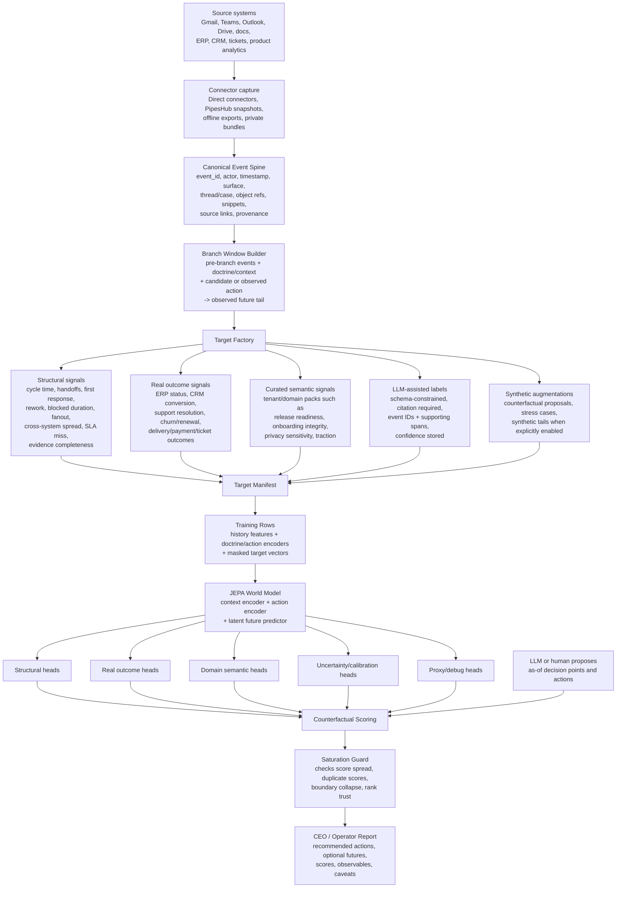

# World Model Training Architecture

This document explains how VEI turns company history into a learned
counterfactual model. Use [ARCHITECTURE.md](ARCHITECTURE.md) for the whole
system map and [WHATIF.md](WHATIF.md) for command references.

The short version:

```text
canonical events are truth
targets are interpretations of later truth
LLMs propose, label, and augment under citation rules
target manifests decide what is supported enough to train or rank on
JEPA learns: state + action -> future vector
reports expose the recommendation and the confidence boundary
```

## Training Loop



## Trust Boundaries

VEI keeps the truth layer and interpretation layer separate.

| Layer | Examples | Training role | Trust posture |
|---|---|---|---|
| Canonical events | Messages, tickets, docs, CRM records, ERP records | Input history and future evidence | Source of truth after normalization |
| Real system outcomes | CRM close status, ERP payment, ticket reopen, delivery status | Highest-trust target heads | Preferred factual labels |
| Structural metrics | Cycle time, handoffs, response delay, fanout, SLA miss | Universal target heads | High trust when timestamps and actor/object refs are healthy |
| Curated domain packs | Release readiness, onboarding integrity, privacy sensitivity | Tenant/domain semantic heads | Supported only when coverage and confidence are visible |
| LLM semantic labels | Citation-backed labels over future events | Medium-trust semantic target candidates | Accepted only with cited event IDs and supporting spans |
| Human-reviewed labels | Reviewed LLM or analyst labels | Calibration and higher-trust examples | Used to tune thresholds and confidence |
| LLM proposals | Decision points and candidate actions | Counterfactual input generation | Not a learned outcome and not ground truth |
| Synthetic future tails | Simulated or imagined outcomes | Optional augmentation only | Experimental, down-weighted, and manifest-marked |

The doctrine is simple:

```text
LLMs are not the truth layer.
Canonical events and real system outcomes are the truth layer.
LLMs propose, summarize, label, and augment under citation/provenance rules.
The target manifest decides what is supported enough to train and rank on.
```

## Target Factory

The target factory converts each observed future window into labels the model is
allowed to learn. The v0 target layer is deliberately small.

Universal structural heads:

- `cycle_time_ms`
- `handoff_count`
- `time_to_first_response_ms`
- `reopen_rework_count`
- `blocked_duration_ms`
- `participant_fanout`
- `cross_system_spread`
- `owner_ambiguity_count`
- `deadline_sla_miss_count`
- `evidence_completeness`

Example v0 domain packs:

| Tenant/domain | Heads |
|---|---|
| SaaS onboarding/product | `onboarding_integrity`, `user_trust_confusion`, `release_readiness` |
| Consumer-data research | `data_coverage_gap`, `compliance_privacy_sensitivity`, `repeated_clarification_loop` |
| Startup product/GTM | `product_readiness_proof`, `gtm_narrative_consistency`, `partner_customer_traction` |

Legacy global proxy heads stay available as `proxy_global_v1` diagnostics. They
are useful for comparison and debugging, but they are not product-grade ranking
heads unless the manifest marks them for that run.

## LLM Label Rules

LLM semantic labeling is an offline target-curation step, not a free-form model
opinion. A label must fit the schema and cite future events:

```json
{
  "target_id": "release_readiness",
  "value": 0.74,
  "confidence": 0.82,
  "horizon": "30d",
  "evidence_event_ids": ["tenant:history_123"],
  "supporting_spans": ["qa passed"],
  "negative_evidence": ["mobile callback still under review"],
  "label_source": "llm_semantic_v1"
}
```

Acceptance rules:

- the target id must be supported for the tenant/domain pack
- every cited event id must exist in the future window
- every supporting span must appear in the cited event text
- missing citations reject the label
- negative evidence is preserved, not erased
- confidence is stored and can be used for weighting or review queues

## Target Manifest

Every dataset/run writes a target manifest. It is the contract between messy
data and model training.

The manifest records:

- supported heads
- experimental heads
- unsupported heads
- label functions used
- coverage per head
- confidence per head
- reviewed examples
- known blind spots

Unsupported heads are masked, not zero-filled. This matters: if a tenant has no
credible `partner_customer_traction` label, the model should not learn that the
value is zero. It should learn that the target is absent.

## Training Rows

Each training row has this shape:

```text
pre-branch canonical events
+ doctrine/context packet
+ observed or candidate action representation
+ future-tail evidence
-> structural targets
-> real outcome targets
-> curated semantic targets
-> proxy/debug targets
```

The pre-branch side is all the model can see at prediction time. The future
tail is used only to derive factual labels during training/evaluation.

## Model Outputs

The JEPA path predicts a future vector, not a magic business answer.

Core heads:

- structural heads: mechanical process outcomes
- real outcome heads: CRM/ERP/ticket/business outcomes when available
- curated semantic heads: domain-pack labels with masks and confidence
- proxy/debug heads: old global proxy ontology for diagnostics
- latent future id: checkpoint-specific representation for comparing futures

The scalar score used in reports is a readout over supported heads. It is
query-time decision support, not a universal learned preference.

## Counterfactual Reports

Strategic state-point runs are separate from training:

1. Build a pre-as-of state dossier from canonical events.
2. Let an LLM or human propose decision points and candidate actions.
3. Score each candidate through the learned future-vector path.
4. Rank only on supported structural/curated heads.
5. Show proxy/debug heads separately.
6. Run the saturation guard before trusting rank order.
7. Emit observables, falsifiers, next-decision triggers, and caveats.

If the saturation guard fails, the output is still useful as a structured
decision aid, but the exact rank order should not be treated as advice.

## Daily Update Path

A daily loop should be incremental and explicit:

```text
new connector snapshots
-> append/verify canonical events
-> rebuild branch windows and target manifests
-> refresh or fine-tune the checkpoint
-> evaluate held-out factual futures
-> run strategic state points for each active tenant
-> publish CEO/operator reports with saturation and coverage caveats
```

The old checkpoint can be updated with new rows, but the manifest must travel
with the checkpoint. If the target coverage changes, the report should say so.

## Scaling View

The model can remain small while the surrounding evidence system grows. Most of
the moat is not parameter count; it is the controlled path from event truth to
decision targets.

Expected scaling pressure:

- more companies increase event and branch-window diversity
- richer ERP/CRM/product outcomes add higher-trust heads
- curated domain packs improve report relevance
- longer histories need stronger temporal encoders
- raw document or meeting embeddings may justify larger models
- human review improves calibration more than blind parameter growth

The event spine, target factory, target manifest, and saturation guard are the
parts that keep scaling from turning into an opaque "ask the LLM" system.
